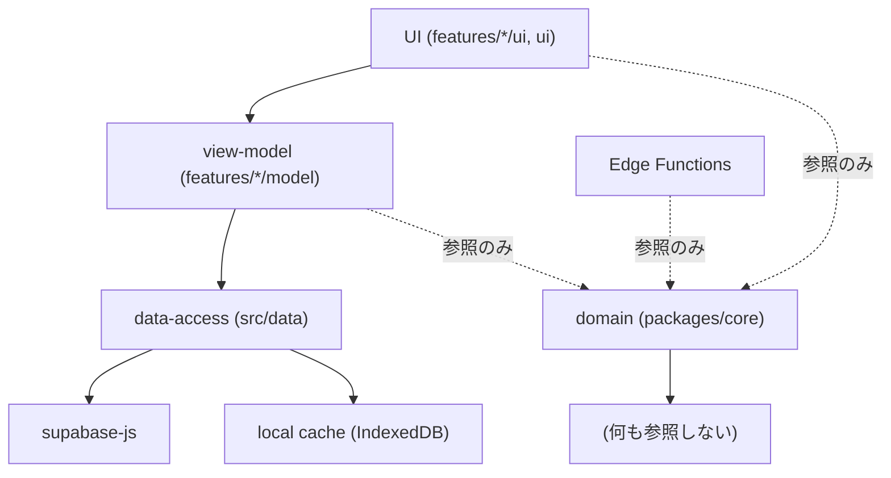
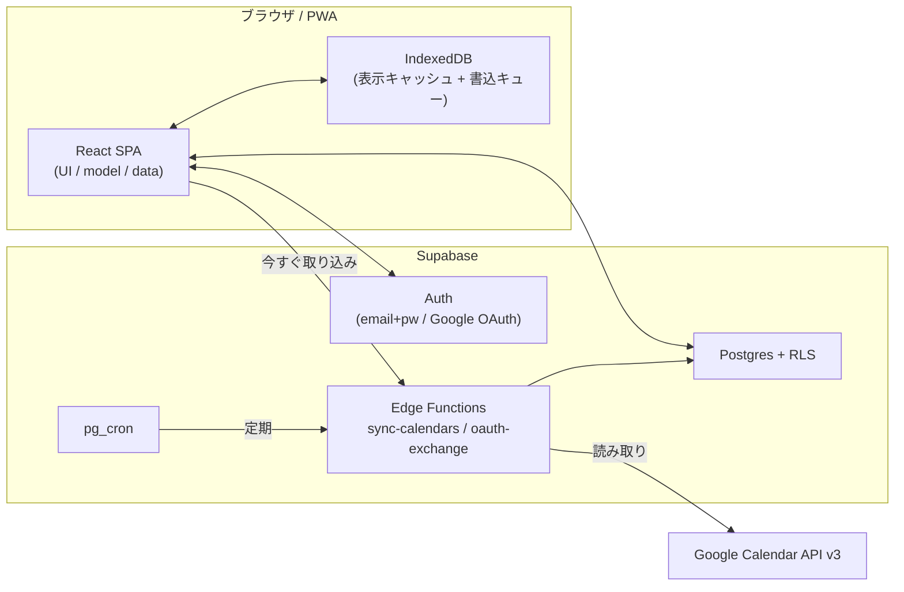
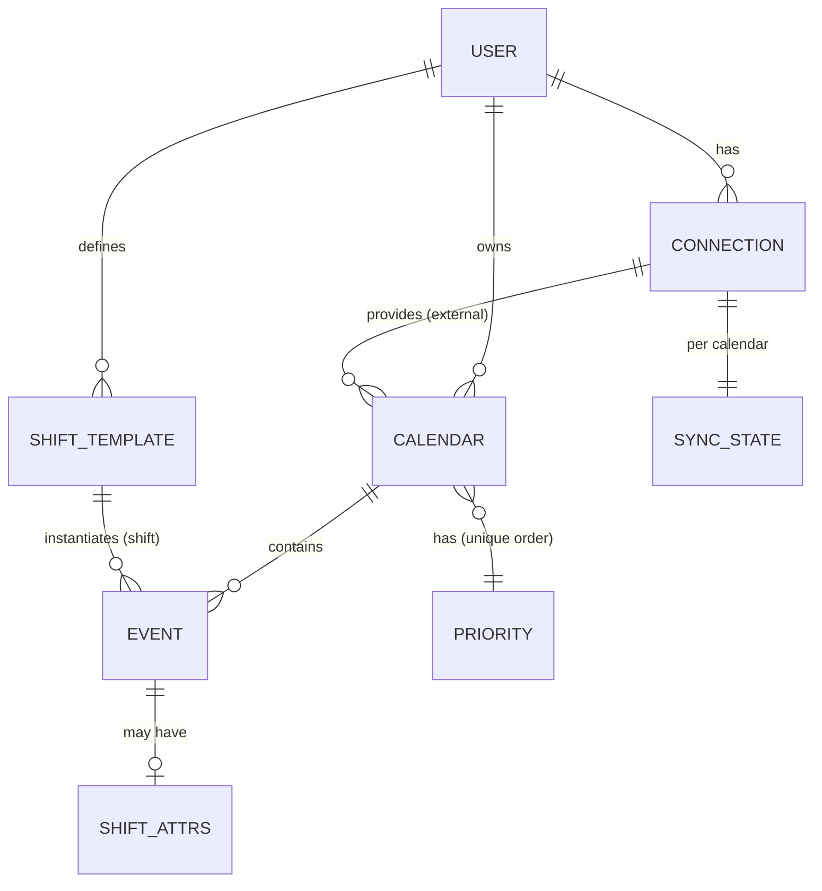

# Architecture Spine — カレンダーアプリ(仮)

## Design Paradigm

**BaaS 上のレイヤード SPA + スケジュール型一方向取り込み。**

- **フロント** は静的 SPA。レイヤは UI → view-model(hooks)→ data-access → 外部。ローカルキャッシュでオフライン表示、書き込みは必ずバックエンド経由。
- **バックエンド** は Supabase(Postgres + Auth + Edge Functions + pg_cron)を BaaS として使う。独自のアプリサーバーは持たない。
- **外部カレンダー** は Edge Function が定期的に Google から**一方向で取り込む**(ETL/pull)。アプリから外部へは書かない(v1)。
- **ドメインの核**(優先度の並び・代表予定の選抜・給料計算)はプラットフォーム非依存の純粋関数群。フロントと Edge Function の両方が同じコードを呼ぶ。

| レイヤ | 置き場所(名前空間) |
| --- | --- |
| UI(画面・コンポーネント) | `src/features/*/ui`, `src/ui` |
| view-model(hooks・画面状態) | `src/features/*/model` |
| data-access(Supabase・ローカルキャッシュ) | `src/data` |
| domain(純粋関数: selection / priority / pay-calc) | `packages/core`(フロント・Edge Function 共有) |
| backend(Edge Functions・SQL) | `supabase/functions`, `supabase/migrations` |

## Invariants & Rules



### AD-1 — 真実の源は Supabase Postgres [ADOPTED]

- **Binds:** all(FR-1〜FR-17)
- **Prevents:** クライアントごとに別の真実を持ち、端末間で状態が食い違う
- **Rule:** すべての永続データは Supabase Postgres に置く。クライアントのローカルキャッシュ(IndexedDB)は**表示専用の複製**であり、更新は必ず data-access レイヤ経由で Supabase に書き、その結果でキャッシュを更新する。全テーブルに `user_id` と RLS。

### AD-2 — 外部カレンダーは一方向取り込みのみ(v1) [ADOPTED]

- **Binds:** FR-3, FR-4, FR-7, FR-9
- **Prevents:** 誰かが「ついで」に Google 書き込みを足し、競合解決の無いまま双方向化して壊す
- **Rule:** `source = 'external'` の予定は読み取り専用。編集・削除の UI も API 経路も作らない。外部サービスへ書き込む関数をコードベースに置かない。取り込みは Google → Postgres の一方向のみ。

### AD-3 — プロバイダ資格情報はサーバー側だけ

- **Binds:** FR-3, FR-4, PRD §8.3
- **Prevents:** refresh token がクライアント・キャッシュ・ログに漏れ、カレンダー全体が第三者に読まれる
- **Rule:** Google の `provider_refresh_token` は Supabase 側(Vault または暗号化カラム、RLS で本人のみ)にのみ保存する。クライアント・ローカルキャッシュ・ログ・エラー本文に出さない。トークン交換と Google Calendar API 呼び出しは Edge Function だけが行う。要求スコープはカレンダー読み取りの最小限(書き込みスコープを要求しない)。

### AD-4 — 取り込みは冪等なスケジュール Edge Function

- **Binds:** FR-4
- **Prevents:** 実行のたびに予定が重複する / 一時失敗で全カレンダーが表示不能になる
- **Rule:** 取り込みは1つの Edge Function。pg_cron で定期起動 + ユーザーの「今すぐ取り込み」で同じ関数を起動。外部イベントの安定 ID で upsert し、外部から消えた予定は論理削除。取り込み単位は「接続 × カレンダー」で、成功時刻・失敗を**カレンダー単位**で記録する。1カレンダーの失敗は他カレンダーの取り込み・表示を止めない。

### AD-5 — 優先度は単一の順序、並びは1か所から導出

- **Binds:** FR-6, FR-7, FR-8, FR-9, FR-10
- **Prevents:** 画面ごとに別の並べ方が実装され、コンパクトビューとカレンダーで順序が食い違う / フロントと Edge Function が同時にカレンダーを作って優先度が重複する
- **Rule:** 優先度はカレンダーごとの整数順序値で、`user_id` 内で一意(DB の unique 制約 `(user_id, priority)` で保証)。優先度の採番・並べ替えは1つの DB 関数(RPC)経由でのみ行い、フロント(FR-5, FR-6)も取り込み Edge Function(FR-4)もそれを呼ぶ。「一覧の並び」「重なり時の描画順」「代表予定の選抜」はすべて `packages/core` の優先度ユーティリティを通す。UI がその場で並べ替えロジックを書かない。

### AD-6 — 代表予定の選抜は純粋関数ひとつ

- **Binds:** FR-9, FR-10(将来: ウィジェット / 通知)
- **Prevents:** アプリ内画面・ウィジェット・通知が別々の選抜を実装し、見える予定がバラバラになる
- **Rule:** 選抜は `packages/core` の純粋関数 `selectFeaturedEvents(events, calendarPriority, now, limit)`。副作用なし・I/O なし・プラットフォーム非依存。`packages/core` は自分の**正規入力型**(camelCase、UTC の `Date`/ISO 文字列)を定義し、呼び出し側(フロント / Edge Function)は自分の表現からそれに変換してから渡す。`now` は呼び出し側が渡す UTC の時点で、関数内部で現在時刻を読まない。全体規則(優先度→開始時刻順 か 優先度→今から近い順)はこの関数の内部実装で、差し替え可能に保つ(PRD §9-1 未確定)。

### AD-7 — 時刻は UTC 保存・表示時変換、終日は日付型

- **Binds:** FR-1, FR-4, FR-13, FR-14
- **Prevents:** ローカル時刻保存と UTC 保存が混在し、日をまたぐシフトの実働時間や月集計がずれる
- **Rule:** 時刻付きの値は `timestamptz`(UTC)で保存し、表示・入力時にユーザーのタイムゾーンへ変換。終日予定は `date`(タイムゾーンを持たない)。実働時間・給料見込みの計算は UTC 上の差分で行う。

### AD-8 — シフトは予定のサブタイプ、集計は都度算出

- **Binds:** FR-11, FR-12, FR-13, FR-14, FR-15
- **Prevents:** 集計キャッシュと明細がずれる / シフトと予定で二重のカレンダー表示ロジックを持つ
- **Rule:** シフトは「シフト用カレンダー」に属する予定 + シフト属性(休憩分・時給・勤務先ラベル・由来テンプレ ID)。専用テーブルを別に立てない(`events` の nullable カラム群)。汎用の予定編集(FR-1)はシフト属性を変更しない(部分更新)。シフト属性の編集は `features/shifts` の経路のみ。給料見込みは対象月の予定から都度計算し、集計値を保存しない。

### AD-9 — クライアントは data-access レイヤ越しにのみ外部へ

- **Binds:** all(フロント)
- **Prevents:** UI から直接 supabase-js を呼ぶコードが散り、オフライン・楽観更新・snake/camel 変換が場当たりになる
- **Rule:** UI・hooks から `supabase-js` を直接呼ばない。すべて `src/data` のリポジトリ関数経由。DB(snake_case)↔ TS(camelCase)変換、楽観更新、オフライン時の書き込みキューはこのレイヤに閉じる。

### AD-10 — 依存は下向き、domain は葉

- **Binds:** all
- **Prevents:** レイヤの逆流(data-access が UI を、domain が data を参照)で単体テストと再利用が壊れる
- **Rule:** 依存方向は UI → view-model → data-access → 外部。逆流禁止。`packages/core`(domain)は何も import せず(標準ライブラリのみ)、どのレイヤからも import されてよい。Edge Function も `packages/core` を共有する。

## Consistency Conventions

| Concern | Convention |
| --- | --- |
| 命名(テーブル / カラム) | snake_case。テーブル: `calendars`, `events`, `connections`, `connection_calendars`, `shift_templates`, `sync_state`。主キー `id`。所有者 `user_id` |
| 命名(TS) | camelCase。型は `Calendar`, `EventItem`(`Event` は DOM と衝突するため回避), `ShiftTemplate` 等。変換は `src/data` のみ |
| ID | UUID v4(DB 生成)。外部予定は `(connection_id, external_id)` を一意制約に |
| 日付・時刻 | 保存は `timestamptz`(UTC)/ 終日は `date`。API・JSON は ISO 8601。表示層でのみ TZ 変換 |
| 金額 | 円は整数(最小単位)。実働時間は分で保持し、計算時に時給へ換算 |
| エラー形 | data-access は `Result<T, AppError>` を返す(throw しない)。`AppError` は `{ kind, messageKey }`。UI は `messageKey` を EXPERIENCE.md Voice の文言に対応づける |
| 状態変更 | 書き込みは data-access リポジトリ関数のみ。楽観更新 → 失敗時ロールバック。オフラインは書き込みキュー(順序保持)→ オンライン復帰でフラッシュ |
| 論理削除 | 削除は `deleted_at` を立てる(取り込み予定の外部消失・ローカル予定の Undo 対応)。data-access の共通ヘルパで全読み取りが `deleted_at IS NULL` を強制 |
| テスト | `packages/core`(domain)は単体テスト必須(選抜・優先度・給料計算)。~~data-access は Supabase ローカル(`supabase start`)で結合テスト。Edge Function は Google API をモックして単体~~ **← 2026-09-11 修正: ローカルに Docker が無く `supabase start` 不可、Deno も無い。実態と代償コントロールは `docs/testing-and-verification.md` に明文化(Epic 1〜3 retro 共通アイテム)** |
| 認証 | Supabase Auth(メール+パスワード / Google)。全テーブル RLS で `user_id = auth.uid()`。未ログインはローカルキャッシュのみで動作(FR-16、Google 接続時にログイン要求) |
| 秘匿情報 | `provider_refresh_token` は Supabase Vault / 暗号化カラム。Edge Function からのみ復号。クライアントへ返さない |
| 同期の実行 | Edge Function `sync-calendars`。pg_cron スケジュール + 手動トリガ。冪等 upsert + 論理削除 |
| ロギング | Edge Function は構造化ログ。予定本文・メール・トークンをログに書かない(カレンダー名・件数・所要時間まで) |

## Stack

| Name | Version |
| --- | --- |
| React | 19.x |
| TypeScript | 5.x |
| Vite | 7.x 目安(2026-09-06 ユーザー確定。着手時にマイナーまで固定) |
| Tailwind CSS | 4.x |
| vite-plugin-pwa(Workbox) | rolling |
| Supabase(Postgres) | Postgres 15+ / プラットフォームは rolling |
| Supabase Edge Functions | Deno ランタイム |
| Google Calendar API | v3(読み取りスコープのみ) |
| Capacitor | 8.x(将来 — Deferred) |

## Structural Seed

### コンテナ図



### コアエンティティ(名前と関係のみ)



### ソースツリー(最小)

```text
repo/
  packages/
    core/            # 純粋ドメイン: selection / priority / pay-calc（フロント + Edge Function 共有）
  src/
    ui/              # 汎用コンポーネント（DESIGN.md トークン）
    features/
      calendar/      # 統合ビュー（月/週/リスト）
      compact/       # コンパクトビュー（ホーム）
      calendars/     # カレンダー管理・優先度
      connections/   # Google 接続フロー
      shifts/        # お気に入りシフト・シフト入力
      pay/           # 給料見込み
      settings/
      auth/
    data/            # Supabase リポジトリ + ローカルキャッシュ + 書込キュー
    app/             # ルーティング・シェル（下タブ）
  supabase/
    migrations/      # DB スキーマ + RLS + pg_cron 設定
    functions/
      sync-calendars/
      oauth-exchange/
```

### デプロイと環境

| 対象 | 方法 |
| --- | --- |
| SPA | 静的ホスティング(Vercel / Cloudflare Pages 等)。ビルド成果物のみ |
| DB スキーマ / RLS / pg_cron | `supabase/migrations` を Supabase CLI で適用 |
| Edge Functions | Supabase CLI でデプロイ |
| 環境 | `prod` 1 つ + ローカル開発(`supabase start`)。ステージングは当面持たない `[ASSUMPTION]` |
| シークレット | Google OAuth クライアント秘密・API キーは Supabase の関数シークレット。クライアントには公開 anon key と OAuth クライアント ID のみ |

## Capability → Architecture Map

| Capability / Area | Lives in | Governed by |
| --- | --- | --- |
| ローカル予定 CRUD(FR-1) | `features/calendar`, `data` | AD-1, AD-7, AD-9 |
| 月/週/リスト表示(FR-2) | `features/calendar` | AD-5, DESIGN.md Layout |
| Google 接続(FR-3) | `features/connections`, `functions/oauth-exchange` | AD-3 |
| 取り込み(FR-4) | `functions/sync-calendars`, `sync_state` | AD-2, AD-3, AD-4, AD-7 |
| カレンダー管理(FR-5) | `features/calendars`, `data` | AD-1, AD-9 |
| 優先度設定(FR-6) | `features/calendars`, `packages/core` | AD-5 |
| 視覚的な優先・並び(FR-7, FR-8) | `features/calendar`, `packages/core` | AD-5 |
| 代表予定の選抜(FR-9) | `packages/core` (`selectFeaturedEvents`) | AD-6 |
| コンパクトビュー画面(FR-10) | `features/compact` | AD-6 |
| お気に入りシフト(FR-11) | `features/shifts`, `data` | AD-8 |
| ワンタップ入力(FR-12) | `features/shifts`, `features/calendar` | AD-8 |
| 実働時間(FR-13) | `packages/core` (pay-calc) | AD-7, AD-8 |
| 給料見込み(FR-14, FR-15) | `packages/core`, `features/pay`, `features/compact` | AD-7, AD-8 |
| ログイン(FR-16) | `features/auth`, Supabase Auth | Conventions(認証) |
| エクスポート(FR-17) | `features/settings`, `data` | AD-1 |

## Deferred

| 項目 | 先送りの理由 |
| --- | --- |
| Capacitor ネイティブ化(ウィジェット・通知・端末カレンダー取り込み) | v2。ネイティブブリッジ設計はその時に。`packages/core` の選抜関数を再利用できる形は今作る(AD-6) |
| 外部への書き戻し(双方向同期)と競合解決 | v2。AD-2 が今の一方向を固定 |
| 精緻な給料計算(割増・締め日・勤務先別・年別) | v2。pay-calc を関数分割しておけば拡張で済む |
| Supabase Realtime での即時反映 | v1 は手動更新 + 定期取り込みで足りる。導入是非は後 |
| オフライン編集の高度なマージ | v1 は「単一ユーザー・後勝ち + 書込キュー順序保持」で割り切る。複雑なマージは需要が出たら |
| ステージング環境・監視・コスト最適化 | 個人配布規模。利用が増えたら再検討 |
| 選抜ロジックの全体規則(優先度→開始時刻順 / 今から近い順) | PRD §9-1 の未解決論点。AD-6 の純関数差し替えで対応 |
| プロダクト名・課金モデル | アーキテクチャに影響なし |
