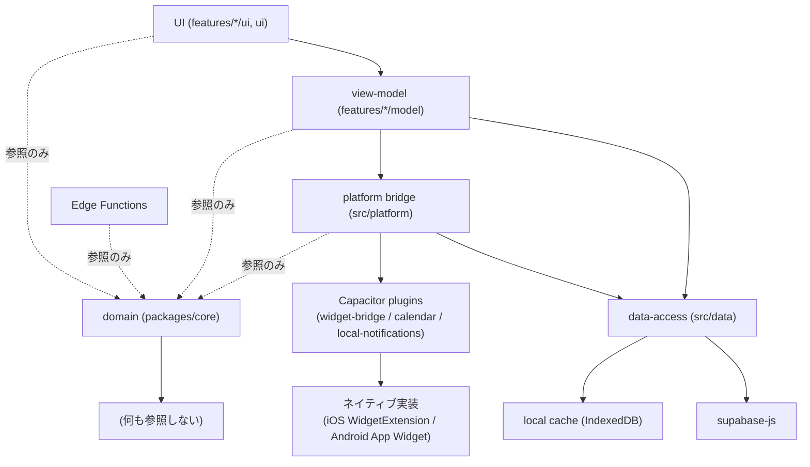
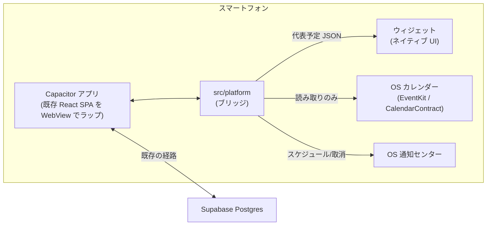

# Architecture Spine — カレンダーアプリ Epic 5(スマホアプリ化)

## Design Paradigm

**Capacitor ラップ + プラットフォーム別ネイティブ・データブリッジ。**

v1 の Web SPA(`src/`, `packages/core`)はそのまま Capacitor でラップして動かす。ネイティブ機能(ウィジェット・端末カレンダー・ローカル通知)は WebView の中では実現できないため、次の3層を新設する。

- **ネイティブブリッジ層**(`src/platform`): Capacitor プラグイン経由で JS ⇄ ネイティブの最小限のデータをやり取りする。ロジックは持たない、受け渡し専用。
- **ネイティブ表示層**(`ios/App/WidgetExtension`, `android/app/.../widget`): ウィジェットの見た目そのもの。WebView が描画できない領域なので、プラットフォームのネイティブ UI フレームワークで書く。
- **共有ドメイン層**(`packages/core`、既存)は変わらず葉のまま。ウィジェット・通知はここの選抜ロジック(`selectFeaturedEvents`, AD-6)をアプリ本体と共有する — 別実装は禁止。

| レイヤ | 置き場所(名前空間) |
| --- | --- |
| UI・view-model・data-access(既存) | 親スペインのまま変更なし |
| ネイティブブリッジ(プラットフォーム API 呼び出し) | `src/platform`(新設) |
| ネイティブ表示(ウィジェット UI) | `ios/App/WidgetExtension`, `android/app/src/main/…/widget`(新設) |
| 共有ドメイン(選抜・通知ID導出・端末カレンダー正規化) | `packages/core`(既存 + 追加) |

## Inherited Invariants

親スペイン `architecture-calendar-app-2026-09-06/ARCHITECTURE-SPINE.md` の以下を読み取り専用の制約として継承する。再決定・再導出はしない。

| Inherited | From parent | Binds here |
| --- | --- | --- |
| AD-1(真実の源は Supabase Postgres) | architecture-calendar-app-2026-09-06 | 端末カレンダーの取り込み結果も Postgres に永続化する(AD-14 参照)。IndexedDB は表示専用のまま |
| AD-2(外部カレンダーは一方向取り込みのみ) | architecture-calendar-app-2026-09-06 | FR-19(端末カレンダー)も読み取り専用。書き込み API は一切呼ばない(AD-13 参照) |
| AD-3(プロバイダ資格情報はサーバー側のみ) | architecture-calendar-app-2026-09-06 | 端末カレンダーは OAuth トークンを持たないため直接該当しないが、権限スコープ最小化の考え方は同じく適用する |
| AD-4(取り込みは冪等なスケジュール Edge Function) | architecture-calendar-app-2026-09-06 | 端末カレンダーにはこの形が使えない(サーバーは端末の EventKit/CalendarContract に物理的にアクセス不能)。代わりに AD-14/AD-17 でクライアント発の取り込みパターンを新規に定める |
| AD-5(優先度は単一の順序、DB 関数経由) | architecture-calendar-app-2026-09-06 | `selectFeaturedEvents` の入力 `calendarPriority` はこの優先度に暗黙に依存する。ウィジェット・通知は独自の優先度計算を持たない |
| AD-6(代表予定の選抜は純粋関数ひとつ) | architecture-calendar-app-2026-09-06 | ウィジェット(FR-18)は `selectFeaturedEvents` の結果をそのまま使う。この再利用は親スペインの時点で既に見込まれていた(Deferred 注記参照) |
| AD-7(時刻は UTC 保存、表示時変換) | architecture-calendar-app-2026-09-06 | リマインダーの相対時刻計算(AD-15)、ウィジェットに表示する開始時刻(AD-12)は両方この規約に従う。端末側で別のタイムゾーン処理を持ち込まない |
| AD-8(シフトはサブタイプ、nullable カラムで表現) | architecture-calendar-app-2026-09-06 | リマインダー設定(AD-15 の `reminder_minutes` 相当)は、この規約と同じ「専用テーブルを立てず `events` の nullable カラムで表現する」パターンを踏襲する |
| AD-9(クライアントは data-access 層越しにのみ外部へ) | architecture-calendar-app-2026-09-06 | 端末カレンダーの Postgres 書き込みも `src/data` 経由。`src/platform` は Postgres に直接書かない |
| AD-10(依存は下向き、domain は葉) | architecture-calendar-app-2026-09-06 | `src/platform` も `packages/core` を参照するだけの側に立つ。ネイティブプラグイン呼び出しを `packages/core` に漏らさない |

## Invariants & Rules



### AD-11 — Capacitor を正式採用し、Web 資産をそのままラップする [ADOPTED]

- **Binds:** all(Epic 5、FR-18, FR-19, FR-20)
- **Prevents:** React Native / Flutter への部分的・全面的な書き換えが始まり、Web 版(Epic 1〜4)と二重管理になる
- **Rule:** 既存の Vite + React19 SPA(`src/`, `packages/core`)は変更しない。`@capacitor/core` 8.x でラップし、`ios/`, `android/` ディレクトリをネイティブプロジェクトとして追加する。ネイティブ機能は「プラットフォーム別ネイティブコード + Capacitor プラグインのブリッジ」でのみ追加する。

### AD-12 — ウィジェットは「データブリッジ + ネイティブ UI」、選抜ロジックは共有する

- **Binds:** FR-18
- **Prevents:** ウィジェットが独自の選抜ロジックを実装してアプリ本体とズレる/逆にウィジェットに JS 実行環境を持たせようとして無理な設計になる(ウィジェットのサーフェスは OS がネイティブに描画する領域で WebView は動かない)
- **Rule:** `selectFeaturedEvents`(AD-6)の呼び出しと結果の整形は必ず JS 側(`src/platform/widget.ts`)で行う。JS は常に **上限3件**(`selectFeaturedEvents` の `limit=3`)を計算し、各行を `{ calendarName: string, colorHex: string, startsAtIso: string, schemaVersion: 1 }` の形の JSON 配列に整形する — **表示するのはカレンダー名・色・開始時刻**(PRD FR-10/FR-18 の要求どおり。予定タイトルは含めない)。ウィジェットの現在サイズ(1/2/3件)に応じて実際に何件描画するかは**ネイティブ側**が切り詰めて決める(OS はウィジェットのリサイズ時に JS を起動しないため、JS 側は常に最大件数を渡しておく)。この JSON を共有ストレージへ書き込む: iOS は App Group `group.{AD-18のプロダクト識別子}.widget` の UserDefaults キー `featuredEvents`、Android は同名の SharedPreferences キー。書き込み後、ネイティブへタイムライン更新を伝える。ブリッジは `capacitor-widget-bridge`(または明示的な後継フォークに限る、無審査での差し替え不可)を使い自作しない。ウィジェットの見た目(レイアウト・描画)は iOS(SwiftUI WidgetKit)・Android(App Widget / Jetpack Glance)ともにネイティブ実装が必須 — この2つの実装は本スペインの対象外(Deferred、ストーリー側で書く)。**更新トリガーはイベント駆動を基本とする**: アプリのフォアグラウンド復帰時・取り込み完了時・予定の作成/編集/削除直後に明示的にタイムライン再読み込みを要求する。OS 側の定期更新(Android の `updatePeriodMillis` 最短30分、iOS の WidgetKit バジェット)は補助であり、アプリを開かない限りの完全なリアルタイム性は保証しない(PRD FR-18 の想定通り)。

### AD-13 — 端末カレンダーは「外部接続」の一種、読み取り専用

- **Binds:** FR-19
- **Prevents:** 端末カレンダーが Google 接続と別データモデル・別 UI パターンになる/誤って書き込み権限を要求し、ストア審査で問題になる
- **Rule:** 端末カレンダーは `connections` テーブルの `provider = 'device'` 行として、既存の Google 接続(`provider = 'google'`)と同じ形でモデル化する。要求する権限は読み取り専用のみ(iOS: `NSCalendarsUsageDescription` の読み取り相当、Android: `READ_CALENDAR` のみ)。書き込み系 API(イベント作成・更新・削除)は一切呼ばない。

### AD-14 — 端末カレンダーの取り込みはクライアント発、data-access 層経由で Postgres へ

- **Binds:** FR-19
- **Prevents:** 「取り込みは1つの Edge Function」という AD-4 の形をそのまま端末カレンダーに当てはめようとして、実現不可能な設計に時間を溶かす
- **Rule:** 端末カレンダーの取り込みはサーバーではなくクライアント(アプリ本体)が起点になる。`src/platform` が `@ebarooni/capacitor-calendar` 経由で端末の EventKit(iOS)/CalendarContract(Android)から生データを読む — この2プラットフォームの API 差異(PRD FR-19 Out of Scope 注記)の吸収はこのプラグイン1本に任せ、自前で吸収層を作らない。読んだ生データは `packages/core` に新設する device 用 normalizer(Google 用 `normalizeGoogleEvent` と同じ出力型 `NormalizedGoogleEvent` 相当 — Edge Function 専用の `EventRow` ではない)で正規化する。正規化後の Postgres への実際の書き込み経路(どの権限で・どの RPC/クエリで書くか)は **AD-17** で定める。トリガーはアプリのフォアグラウンド復帰時 + 手動更新。OS のバックグラウンド定期実行は Android/iOS ともに制約が強く不安定なため、v1 では持たない。

### AD-15 — リマインダー通知は端末ローカルでスケジュールし、予定編集/削除に追従する

- **Binds:** FR-20
- **Prevents:** 通知 ID と予定の対応が場当たりになり、予定を削除しても通知が残る/複数箇所で違う ID 導出ロジックが生まれて衝突する
- **Rule:** 通知は `@capacitor/local-notifications` で端末ローカルにスケジュールする(push 配信サーバーは持たない)。通知 ID は `events.id`(UUID)から決定的に導出した**符号あり 32bit 整数**(`-2147483648`〜`2147483647`。Android の `int` 型に合わせる)を使う。導出関数は `packages/core` に置き、呼び出し側が独自にハッシュを書かない。ハッシュ衝突(異なる予定が同じ ID になる)は個人利用規模では検出・回避しない — 衝突時は後着の `cancel()`/`schedule()` が先の通知を上書きしてよい、という劣化を許容する。1 予定につき通知は最大 1 件(複数リマインダーは Deferred)。**予定の時刻が変わるすべての経路**(ユーザーによるアプリ内編集・削除だけでなく、Google 取り込み・端末カレンダー取り込みの同期 upsert が予定時刻を書き換えた場合も含む)で、同じ導出 ID による `cancel()` → 必要なら `schedule()` し直しを必ず経由する。リマインダー設定(分数、`null` で通知なし)は `events` テーブルの nullable カラムとして保存する(AD-8 のサブタイプ属性と同じパターン)。サーバー側に通知スケジュールという概念は持たせない。

### AD-16 — ウィジェット・通知のタップは同じディープリンク経路で予定へ遷移する

- **Binds:** FR-18, FR-20
- **Prevents:** ウィジェットタップ用と通知タップ用で別々の遷移の仕組みが作られ、片方だけ動く/URL 形式が食い違ってリンク切れになる
- **Rule:** ディープリンクは AD-18 のプロダクト識別子から導出したカスタムスキーム(暫定: `calendar-app://`)で確定する — 「例」ではなく決定値であり、変更する場合は iOS `Info.plist` の `CFBundleURLSchemes` と Android Manifest の `intent-filter scheme` を同一 PR で両方直す。URL 形状は用途ごとに固定する: 予定へは `calendar-app://event/{eventId}`、該当日へは `calendar-app://day/{yyyy-mm-dd}`(ウィジェットが 0 件時・日付ベース表示のときに使う)。受け口は既存の `src/app`(ルーティング・シェル)に1つだけ実装し、ウィジェット/通知それぞれのネイティブ側は「このスキームで OS に開かせる」以上のことをしない。存在しない/削除済みの予定 ID を渡された場合は統合ビューへフォールバックする。

### AD-17 — 端末カレンダーの書き込み経路は「クライアント直接・RLS 経由」、Google の service_role RPC は流用しない [ADOPTED]

- **Binds:** FR-19
- **Prevents:** 実装者が「Google と同じ形」という言葉だけを頼りに、`service_role` 専用かつ `p_user_id` を検証していない既存 RPC(`apply_calendar_sync` 等)を `authenticated` に開放してしまい、他ユーザーの予定へ書き込める脆弱性を作り込む
- **Rule:** 端末カレンダーには Google の refresh token のような「保護すべき秘密」が無いため、Edge Function/`service_role` を経由する必要が無い。取り込みは**認証済みクライアントが `src/data` 経由で `supabase-js` を直接呼び**、既存の RLS(`events`/`calendars` とも `user_id = auth.uid()`)の範囲内で upsert する。差分検知(取り込み元から消えた予定の論理削除)は「対象 `connection_id`+`calendar_id` の既存行を SELECT → 今回読んだ外部 ID と diff → upsert / `deleted_at` セット」という**クライアント側の逐次処理**として実装し、新しい `security definer` RPC は作らない。既存の `apply_calendar_sync` / `get_google_sync_targets` 系 RPC は Google・`service_role` 専用のまま変更しない(`authenticated` への `grant` は禁止)。端末カレンダーの選択カタログは `connection_calendars` テーブルを再利用する(スキーマ自体は provider 非依存)。ただし現行 RLS は Google 用に SELECT のみ許可・書き込みは `service_role` 専用のため、**新しい RLS ポリシーを追加**し、`connection_id` が指す `connections` 行の `provider = 'device'` かつ本人所有のときに限り `authenticated` の INSERT/UPDATE を許す(Google 行への既存ポリシーは変更しない)。`connections.provider` / `calendars.source` / `events.source` の3箇所の CHECK 制約は、1本のマイグレーションでリテラル文字列 `'device'` を追加する形にそろえる(iOS/Android で値を分けない)。

### AD-18 — プロダクト識別子を暫定確定し、Bundle ID・App Group・URL スキームがそこから導出される

- **Binds:** all(Epic 5)
- **Prevents:** プロダクト名未定(PRD §9-7)を理由に、iOS/Android の担当が Bundle ID・App Group ID・ディープリンクスキームをそれぞれ独立に仮決めし、3つが食い違う(App Group の1文字違いなどは実機で静かに失敗し気づきにくい)
- **Rule:** プロダクト識別子を暫定値 `jp.ryo.calendarapp` として1つ確定する。`capacitor.config.ts` の `appId`、iOS/Android の App Group ID(`group.jp.ryo.calendarapp.widget`)、ディープリンクスキーム(`calendar-app`、AD-16)はすべてこの1つの値から機械的に導出し、`src/platform` か設定ファイル1箇所に定数として置く。プロダクト名が正式決定した際は、この3箇所を同一 PR で同時に変更する(独立に一部だけ変えることを禁止)。

## Consistency Conventions

| Concern | Convention |
| --- | --- |
| ネイティブブリッジの置き場所 | `src/platform`(widget.ts / deviceCalendar.ts / reminders.ts)。Capacitor プラグイン呼び出しはここに閉じ、UI・view-model から直接呼ばない(AD-9 と同じ考え方) |
| 通知 ID | `packages/core` の導出関数(UUID → 符号あり 32bit int)一本のみを使う。個別に `Math.random()` や別ハッシュを実装しない(AD-15) |
| 端末カレンダーのデータ形 | 生データは `NormalizedGoogleEvent` 相当の正規化型を経由し(AD-14)、Postgres への実書き込みは AD-17 の RLS 直接 upsert 経路のみ。`events`/`calendars` とも `source`/`provider` 列にリテラル `'device'` を使う |
| 権限要求 | 常に読み取り専用スコープの API を選ぶ(カレンダー: read-only、通知: ローカル通知のみ)。書き込み・フルアクセス系のスコープは要求しない |
| 権限拒否時のエラー表現 | 端末カレンダー・通知いずれの権限拒否も、既存の `Result<T, AppError>` / `messageKey` 規約(親スペイン Conventions「エラー形」)にそのまま乗せる。`src/platform` 独自のエラー型は作らない |
| プラットフォーム分岐 | Capacitor の `Capacitor.getPlatform()` で判定するのは `src/platform` 内のみ。UI コンポーネントに `if (ios/android)` を書かない |

## Stack

| Name | Version |
| --- | --- |
| @capacitor/core, @capacitor/ios, @capacitor/android | 8.5.1(2026-09-12 npm 確認) |
| capacitor-widget-bridge | 8.1.0(2026-09-12 時点最新。単独メンテナの小規模プラグイン — バスファクターリスクあり、着手直前にメンテ状況を再確認すること) |
| @ebarooni/capacitor-calendar | 最新(Capacitor 8.x 対応、`requestReadOnlyCalendarAccess()` あり) |
| @capacitor/local-notifications | 8.x 系(公式 first-party) |
| iOS ネイティブ(ウィジェット) | Swift + SwiftUI(WidgetKit) |
| Android ネイティブ(ウィジェット) | Kotlin + Jetpack Glance または RemoteViews(App Widget) |

## Structural Seed

### コンテナ図(親スペインへの追加分)



### ソースツリー(親スペインへの追加分)

```text
repo/
  packages/
    core/                     # 既存 + 端末カレンダー用 normalizer・通知ID導出関数を追加
  src/
    platform/                 # 新設: Capacitor プラグインブリッジ
      widget.ts                #   選抜結果を共有ストレージへ push
      deviceCalendar.ts        #   端末カレンダー読み取り→正規化→data-access へ橋渡し
      reminders.ts             #   ローカル通知のスケジュール/取消
  ios/
    App/
      WidgetExtension/         # 新設: SwiftUI WidgetKit(ウィジェットのネイティブ UI)
  android/
    app/src/main/…/widget/     # 新設: App Widget(ウィジェットのネイティブ UI)
```

### デプロイと環境(親スペインへの追加分)

| 対象 | 方法 |
| --- | --- |
| モバイルアプリのビルド | Capacitor CLI(`npx cap sync`)+ Xcode(iOS)/ Android Studio(Android)。CI/CD 自動化は Deferred、v1 は手動ビルド |
| iOS 配布 | App Store Connect 経由(TestFlight → 審査)。Apple Developer Program 未登録(PRD §9 item 8、PM 判断待ち)— 登録前でもシミュレータ・実機(自分の端末)での開発は可能。配布には登録必須 |
| Android 配布 | Google Play Console(内部テストトラック → 段階的公開) |
| 署名鍵の管理 | iOS provisioning profile・Android キーストアは Ryo 本人が保持し外部サービスに預けない。紛失すると同じ app id での再配布ができなくなるリスクがあるため、バックアップ場所を決めておく |
| ネイティブビルドへのシークレット受け渡し | Web ビルド(Vite の env 注入)とは別経路。Xcode / Android Studio のビルド設定ファイル(`.xcconfig` / `local.properties` 等、リポジトリにコミットしない)経由で渡す |
| アプリ更新の配布方式 | v1 は JS バンドルの変更を含めて毎回ストア審査を経る。ライブ更新(OTA)の仕組みは採用しない(Deferred。必要になれば各ストア規約への適合を含めて再検討) |

## Capability → Architecture Map

| Capability / Area | Lives in | Governed by |
| --- | --- | --- |
| FR-18 ホーム画面ウィジェット | `src/platform/widget.ts`(push側) + `ios/App/WidgetExtension`, `android/…/widget`(表示側) | AD-6, AD-12, AD-16, AD-18 |
| FR-19 端末カレンダー取り込み | `src/platform/deviceCalendar.ts`(読取) + `packages/core`(normalizer) + `src/data`(永続化) | AD-2, AD-13, AD-14, AD-17 |
| FR-20 リマインダー通知 | `src/platform/reminders.ts`(スケジュール) + 既存編集/削除フック + Google/端末カレンダー同期 upsert 経路(双方) + `packages/core`(ID導出) | AD-15, AD-16 |
| ウィジェット/通知タップ→予定へ遷移 | `src/app`(ディープリンク受け口) | AD-16, AD-18 |

## Deferred

| 項目 | 先送りの理由 |
| --- | --- |
| ウィジェットのネイティブ実装そのもの(SwiftUI / Jetpack Glance のレイアウト・タイマー) | ストーリー単位の実装詳細。本スペインは「データブリッジ + ネイティブUI」という境界だけ固定する(AD-12) |
| iOS Apple Developer Program 登録の可否 | PRD §9 item 8、PM(Ryo)判断待ち。技術方式はどちらでも成立するため未決着のまま進める |
| モバイルビルドの CI/CD 自動化 | v1 は手動ビルドで足りる個人配布規模。利用が増えたら再検討 |
| 1 予定に複数リマインダー | FR-20 は 1 件のみ。必要になったら AD-15 の ID 導出スキームを拡張する形で対応 |
| Android バックグラウンド定期での端末カレンダー同期 | OS 制約(Doze/バッテリー最適化)が強く不安定。v1 はフォアグラウンド復帰時 + 手動更新のみ |
| Doze・再起動に対する通知の高度な耐性 | v1 は `allowWhileIdle` 程度に留める。実運用で問題が出たら Deferred から昇格 |
| ウィジェットのレイアウトカスタマイズ・直接操作 | PRD FR-18 の Out of Scope と同じ |
| ステージング環境・監視 | 親スペインの Deferred を継承。個人配布規模のため |
